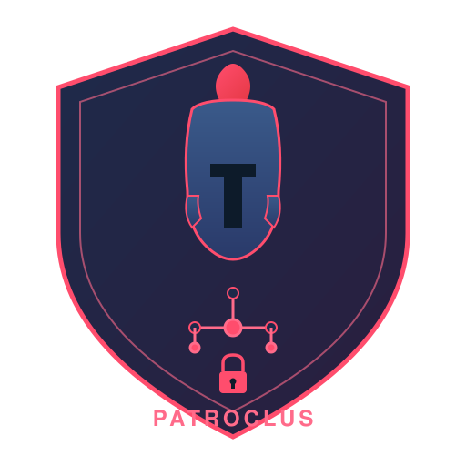

<p align="center">
  
</p>

# Patroclus

**Scoped, time-limited authorization infrastructure for AI agents.**

In the Iliad, Achilles delegated his armor and authority to Patroclus with explicit
scope: drive the Trojans from the ships, then return. Patroclus exceeded his scope,
pursued too far, and the consequences were catastrophic. Patroclus (the project)
ensures that never happens to your AI agents.

---

## What is this?

Patroclus is a self-hostable authorization control plane for AI agents. It sits
between agents and the resources they need to access — APIs, MCP servers,
databases, cloud services — and enforces scoped, time-limited, revocable
permissions with human-in-the-loop approval workflows.

Agents today are handed static API keys and long-lived tokens. Patroclus replaces
that with **just-in-time access**: an agent requests access to a specific resource
for a specific action, policies are evaluated in real-time, and either a
short-lived scoped credential is issued or a human approval is triggered.

## Capabilities

### Core Authorization
- **Just-in-time token issuance** — agents get scoped, short-lived JWTs (5–15 min)
  only when policy allows it. No standing permissions.
- **Default-deny** — no matching policy means deny, always
- **Per-call policy evaluation** — every action checked against policy in real-time
- **Hot-reloadable policies** — create/update policies without server restart

### Delegated Authorization
- **Human delegation** — humans delegate scoped permissions to agents with
  constraints (max spend, time windows, etc.)
- **Multi-agent delegation** — agents sub-delegate with monotonic attenuation
  (scopes can only narrow, never widen)
- **Delegation depth limits** — configurable max chain depth
- **Cascade revocation** — revoking a parent grant atomically invalidates all
  children and issued tokens

### Approval Workflow
- **Human-in-the-loop** — sensitive actions trigger approval requests routed to
  resource owners or admins
- **Single-use approval tokens** — approved requests get one-time, action-scoped
  tokens
- **Approval lifecycle** — pending → approved/denied, with expiry and status lookup

### Advanced Policy Engine
- **YAML rules** with pattern matching (`dev-*`, `api:*`, `*`)
- **Rate limiting** — per agent/action/resource sliding window
- **Budget caps** — deny after cumulative spend exceeds limit
- **Progressive trust decay** — auto-tighten permissions after idle time
- **Workflow sequencing** — require prior action in session trajectory
- **Max actions per session** — cap total actions in a session
- **Pluggable backends** — OPA/Rego and Cedar ready (interface defined)

### Session Management
- **Per-session trajectory** — tracks all actions in a session (capped at 1000)
- **Kill switch** — emergency agent termination kills all sessions + revokes tokens
- **Spend tracking** — record and accumulate spend per session
- **Trust level** — starts at 1.0, decays after configurable idle threshold

### Credential Vault
- **AES-256-GCM encryption** at rest for upstream provider credentials
- **OAuth provider integrations** — GitHub, Google, Slack refresh token exchange
- **Token vending** — agents get scoped access tokens, never see raw secrets
- **Per-principal isolation** — each principal's credentials stored separately

### Token Security
- **JWT RS256** with agent-specific claims (`sub`, `act`, `scope`, `aud`, `jti`)
- **Audience binding** (RFC 8707) — tokens bound to specific resources
- **Replay protection** — JTI tracking with in-memory revocation store
- **Token revocation** — by JTI, with DB persistence
- **DPoP ready** — proof-of-possession support (interface defined)

### Audit & Compliance
- **Hash-chained audit log** — SHA-256 chain, tamper-evident
- **Every decision logged** — allow, deny, require_approval with full context
- **Attribution-complete** — every action traces to human or system authority
- **Delegation chain in log** — full chain captured, not reconstructed

### MCP Gateway Integration
- **Relay integration** — [Relay](https://github.com/rShetty/relay) MCP gateway
  calls Patroclus before every tool dispatch
- **Per-tool authorization** — each MCP `tools/call` checked against policy
- **Fail-closed** — if Patroclus is unreachable, tool calls are denied

### IdP Federation
- **OIDC integration** — Okta, Azure AD, Google Workspace, Auth0, any OIDC provider
- **Group-based policy mapping** — IdP groups map to Patroclus policies (e.g., "Engineering" group → dev access policy)
- **Token exchange** — RFC 8693 token exchange from IdP token → Patroclus delegation token
- **Auto-provisioning** — principals auto-created on first IdP login

### Agent Supply Chain Security
- **Forge integration** — [Forge](https://github.com/rShetty/forge) verifies agent
  signatures, generates SBOMs, scans for vulnerabilities, and calculates trust scores
- **Trust-based policies** — Patroclus policies can reference Forge trust scores (min_trust_score)
- **Blocking** — agents with critical vulnerabilities are blocked from registration

## Architecture

```
┌─────────────────────────────────────────────────────────────────────┐
│                        PATROCLUS                                     │
│                                                                      │
│  ┌──────────┐   ┌──────────────┐   ┌─────────────┐   ┌──────────┐  │
│  │  Agent    │──▶│  Request     │──▶│  Policy     │──▶│ Decision │  │
│  │  Runtime  │   │  Gateway     │   │  Engine     │   │  Router  │  │
│  └──────────┘   └──────────────┘   └─────────────┘   └─────┬────┘  │
│                       │                                      │       │
│                       │              ┌────────────┐    ┌─────▼────┐  │
│                       │              │  Approval  │    │  Token   │  │
│                       │              │  Service   │◀──│  Issuer  │  │
│                       │              └──────┬─────┘    └─────┬────┘  │
│                       │                     │                │       │
│  ┌──────────┐    ┌────▼─────┐   ┌───────────┴──┐    ┌───────▼────┐ │
│  │  Human   │◀───│  Notify  │   │  Audit Log    │   │  Credential│ │
│  │  Approver│───▶│  Service │   │  (Hash-chain) │   │  Vault     │ │
│  └──────────┘    └──────────┘   └──────────────┘   └────────────┘ │
│                                                                      │
│  ┌──────────────────────────────────────────────────────────────┐   │
│  │     Policy Store (YAML)  │  Session Store  │  Resource Registry│   │
│  └──────────────────────────────────────────────────────────────┘   │
└─────────────────────────────────────────────────────────────────────┘
```

## Quick Start

```bash
# Build
cargo build --release

# Initialize config
./target/release/patroclus init

# Generate RSA keys for token signing
./target/release/patroclus generate-keys -o keys

# Start the server
./target/release/patroclus serve --config config.toml
```

## Python SDK

```bash
pip install -e sdk/python
```

```python
from patroclus_sdk import PatroclusClient, authorized_action

client = PatroclusClient("http://localhost:8484")

# Register agent
agent = client.register_agent("my-agent", owner_id=principal["id"])

# Create policy
client.create_policy("dev-access", """
- name: allow-dev-reads
  actions: ["read"]
  resources: ["dev-*"]
  scopes: ["*"]
  decision: allow
  reason: Dev read access permitted
""")

# Check access
result = client.request_access(agent["id"], "read", "dev-db", ["db:read"])
if result.allowed:
    print(f"Token: {result.token}")  # JWT with 15-min TTL

# Or use the decorator
@authorized_action(client, action="read", resource="dev-db", scopes=["db:read"])
def fetch_users(agent_id, patroclus_token=None):
    return call_database(patroclus_token)
```

## Real Agent Demo

```bash
# Start Patroclus
./target/release/patroclus serve

# Run the agent (requires OPENROUTER_API_KEY)
OPENROUTER_API_KEY=your-key python examples/agent.py
```

The agent:
1. Registers itself with Patroclus
2. Creates a policy
3. Asks the LLM (via OpenRouter) what actions to take
4. Before each action, checks with Patroclus for authorization
5. If allowed, gets a scoped JWT token
6. If denied, reports the reason (rate limit, policy deny, etc.)
7. If approval required, creates an approval request

## API Overview

| Category | Endpoints |
|---|---|
| Agent-facing | `POST /v1/agent/request-access`, `POST /v1/agent/check`, `POST /v1/agent/delegate` |
| Principal-facing | `POST /v1/principal/delegate`, `GET /v1/principal/approvals`, `POST /v1/principal/approvals/{id}/approve` |
| Admin | `POST /v1/admin/agents`, `POST /v1/admin/policies`, `GET /v1/admin/audit` |
| Sessions | `GET /v1/sessions`, `POST /v1/sessions/{id}/kill`, `POST /v1/admin/agents/{id}/kill` |
| Vault | `POST /v1/vault/credentials`, `POST /v1/vault/vend` |
| Health | `GET /health` |

See [docs/LLD.md](docs/LLD.md) for the full API specification.

## Token Model

```json
{
  "iss": "https://patroclus.example.com",
  "sub": "user:alice@example.com",
  "act": { "sub": "agent:agent_001", "delegation_depth": 0 },
  "scope": "db:read:prod-db/users",
  "aud": "resource:prod-db",
  "exp": 1723643820,
  "jti": "01J5Q3Z...",
  "constraints": { "max_rows": 1000 }
}
```

## Policy Example

```yaml
- name: allow-dev-reads
  actions: ["read", "query"]
  resources: ["dev-*", "test-*"]
  scopes: ["*"]
  decision: allow
  reason: Dev read access permitted

- name: rate-limited-api
  actions: ["call"]
  resources: ["api-*"]
  scopes: ["*"]
  decision: allow
  reason: API access permitted
  rate_limit_per_minute: 5

- name: budget-capped-deploy
  actions: ["deploy"]
  resources: ["cloud-*"]
  decision: allow
  max_spend: 100.0

- name: require-approval-prod
  actions: ["write", "deploy"]
  resources: ["prod-*"]
  decision: require_approval
  reason: Production operations require human approval

- name: workflow-sequenced
  actions: ["execute_trade"]
  resources: ["trading-*"]
  decision: allow
  require_prior_action: "load_profile"
```

## Test Results

| Suite | Tests | Status |
|---|---|---|
| Rust unit (session) | 10 | ✅ |
| Rust integration (Phase 1–4) | 40 | ✅ |
| Rust integration (Phase 5) | 14 | ✅ |
| Python SDK | 17 | ✅ |
| **Total** | **81** | **All passing** |

```bash
# Run all Rust tests
cargo test

# Run Python SDK tests (requires running server)
cd sdk/python && python -m pytest tests/
```

## Ecosystem

Patroclus is part of a four-project agent governance ecosystem:

| Project | Role |
|---|---|
| [Hive](https://github.com/rShetty/hive) | Agent runtime & orchestration — which agent does the work |
| **Patroclus** | Authorization infrastructure — is the agent allowed to do this |
| [Relay](https://github.com/rShetty/relay) | MCP gateway & tool proxy — route the agent's tool calls |
| [Miser](https://github.com/rShetty/miser) | Cost optimization — which model is cheapest for this |
| [Sentiel](https://github.com/rShetty/sentiel) | Observability, DLP & compliance — what are agents doing? |
| [Aegis](https://github.com/rShetty/Aegis) | Network egress & attestation — is the agent's network safe? |
| [Forge](https://github.com/rShetty/forge) | Agent supply chain security — is the agent code trusted? |

See [docs/ECOSYSTEM_PLAN.md](docs/ECOSYSTEM_PLAN.md) for the full integration plan.

## Documentation

- [High-Level Design](docs/HLD.md) — system overview, principles, components
- [Low-Level Design](docs/LLD.md) — module architecture, DB schema, API spec
- [E2E Architecture](docs/E2E_ARCHITECTURE.md) — complete flow diagrams and scenarios
- [Ecosystem Plan](docs/ECOSYSTEM_PLAN.md) — Hive + Patroclus + Relay + Miser integration
- [Project Plan](PLAN.md) — original planning document with landscape review

## Future Roadmap

### Near-term
- [ ] OPA/Rego policy backend
- [ ] Cedar policy backend
- [ ] PostgreSQL backend (production database)
- [ ] Redis for distributed session state and rate limiting
- [ ] Signed revocation feed (offline verification without callback)
- [ ] DPoP proof-of-possession (RFC 9449)
- [ ] TypeScript/Node SDK
- [ ] Go SDK

### Medium-term
- [ ] Admin dashboard (React/Next.js)
- [ ] CLI tool for policy management
- [ ] Helm chart for Kubernetes deployment
- [ ] OAuth 2.1 well-known endpoints (`/.well-known/oauth-authorization-server`)
- [ ] Dynamic client registration (RFC 7591)
- [ ] Temporal policies (trajectory-aware, like Amazon Bedrock AgentCore)
- [ ] Anomaly detection (behavioral baseline deviation)
- [ ] W3C Verifiable Credentials support

### Long-term
- [ ] Multi-tenancy (tenant isolation)
- [ ] SPIFFE/SPIRE workload identity integration
- [ ] Enterprise IdP federation (Okta, Azure AD, Google)
- [ ] Agent-to-agent trust protocol (IATP)
- [ ] Compliance framework mapping (EU AI Act, SOC2, HIPAA)
- [ ] SDK for LangChain, CrewAI, OpenAI Agents SDK, Google ADK

## Technology Stack

| Component | Technology |
|---|---|
| Language | Rust (edition 2024) |
| Web framework | Axum 0.8 |
| Database | SQLite (rusqlite, bundled) |
| Token format | JWT RS256 (jsonwebtoken) |
| Encryption | AES-256-GCM (aes-gcm) |
| Policy engine | YAML rules (OPA/Cedar ready) |
| Python SDK | httpx |

## License

MIT
